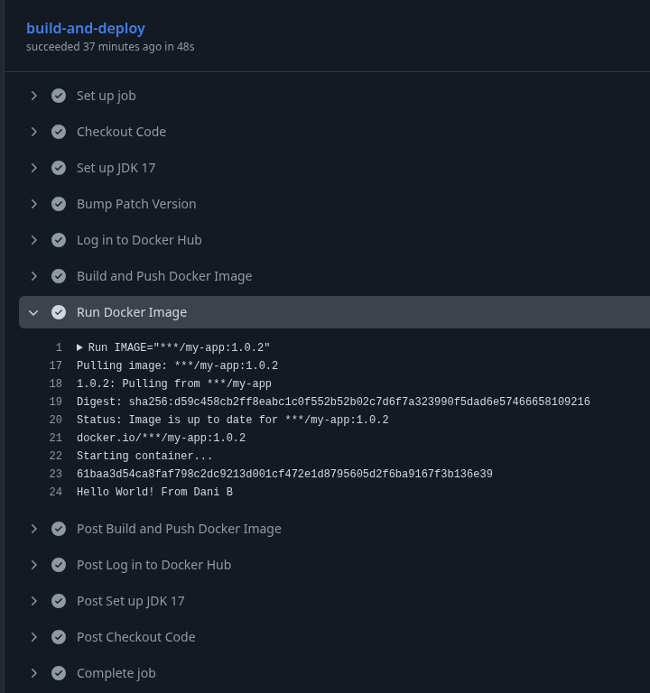
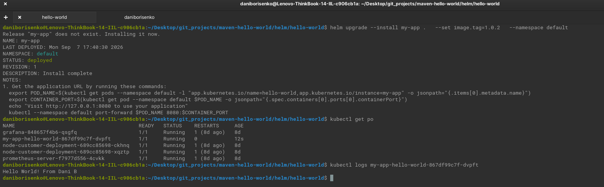

# Java Maven Background Service & Kubernetes Deployment

A Java-based background application managed with Maven, containerized using Docker multi-stage builds, and deployed to Kubernetes via Helm.

---

## 📌 Project Overview

This project demonstrates a complete CI/CD and containerization workflow for a Java background worker application. 

### Key Features
* **Maven Build System:** Manages Java dependencies and handles automatic patch version incrementing.
* **Multi-Stage Dockerfile:** Produces a minimal JRE container running under a non-root user for enhanced security.
* **Automated CI/CD:** GitHub Actions pipeline compiles, tests, packages, tags, and pushes Docker images to Docker Hub.
* **Helm Chart Deployment:** Deploys the application to Kubernetes using `exec`-based readiness and liveness probes suitable for background processes.
* **Tested on minikube:** This project was tested on a minikube cluster
---

## 📸 Pipeline & Deployment 

### CI/CD Pipeline 


### Kubernetes Workload Deployment


---
## How To Test
Start minikube cluster
```bash
  minikube start
```
Install with `helm`
```bash
helm upgrade --install my-app .   --set image.tag=1.0.2   --namespace default
```

Verify deployment
```bash
# Verify pod status
kubectl get pods -l app.kubernetes.io/name=my-app

# Check application output logs
kubectl logs -f deployment/my-app

# Verify readiness and liveness exec probes
kubectl describe pods -l app.kubernetes.io/name=my-app
```

--- 
## 🛠 Project Structure

```text
.
├── Dockerfile
├── helm
│   └── hello-world
│       ├── Chart.yaml
│       ├── templates
│       │   ├── deployment.yaml
│       │   ├── _helpers.tpl
│       │   ├── hpa.yaml
│       │   ├── httproute.yaml
│       │   ├── ingress.yaml
│       │   ├── NOTES.txt
│       │   ├── serviceaccount.yaml
│       │   ├── service.yaml
│       │   └── tests
│       │       └── test-connection.yaml
│       └── values.yaml
├── myapp
│   ├── pom.xml
│   └── src
│       ├── main
│       │   └── java
│       │       └── com
│       │           └── myapp
│       │               └── App.java
│       └── test
│           └── java
│               └── com
│                   └── myapp
│                       └── AppTest.java
└── readme.md
